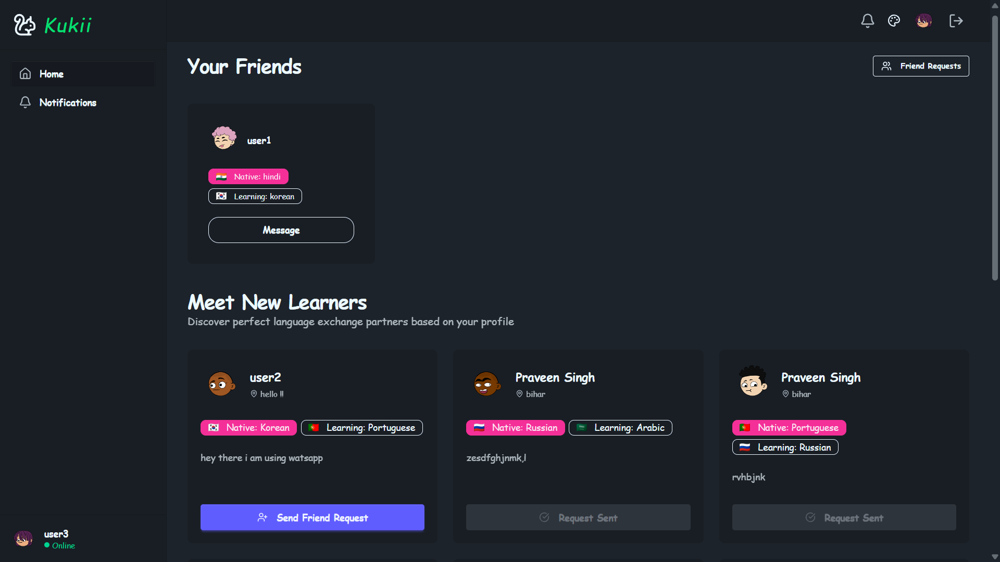
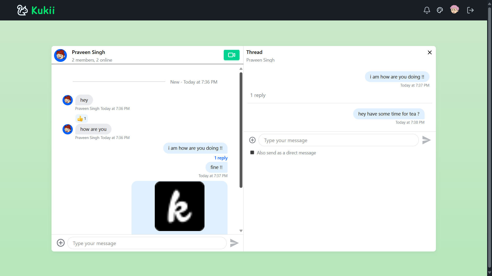
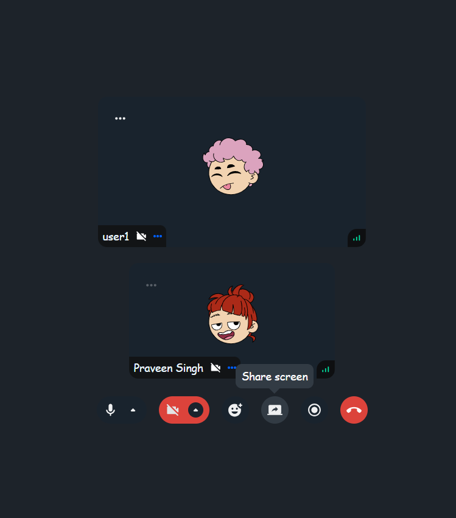
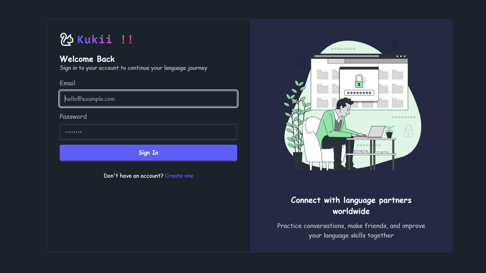
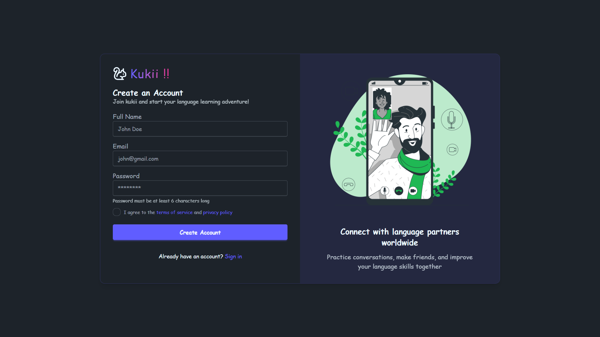
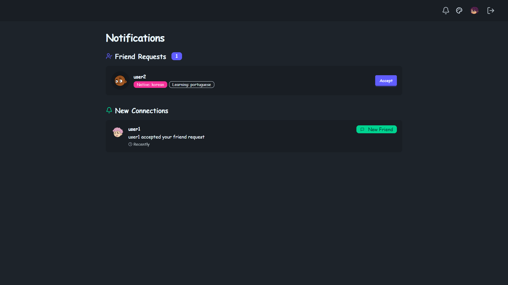
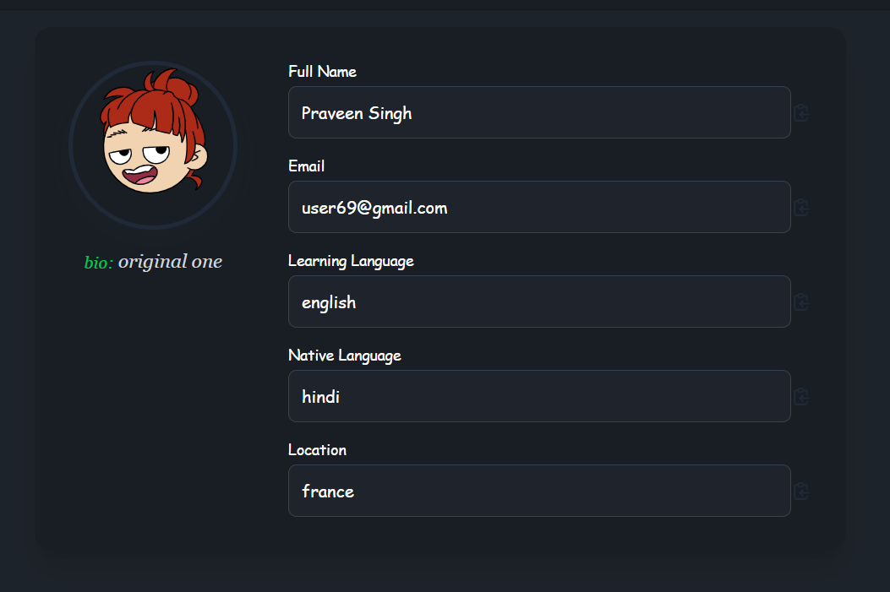

<h1 align="center">🌍 Kukiii – Connect. Learn. Grow. 🌍</h1>

<p align="center">
  
  
  
</p>

<p align="center">
  Kukiii is a next-generation social platform that blends real-time communication with interactive language learning.<br>
  Connect with native speakers, engage in authentic conversations, and grow across cultures — all in one place.
</p>

---

## 🚀 Key Features

### 🌐 Multi-Language Chat
- Real-time chat with automatic translation
- Smart language partner matching
- Cultural exchange communities

### 📹 Seamless Video Calls
- High-quality video with global low-latency
- Screen sharing & virtual background support

### 📚 Learn While You Chat
- Extract vocabulary from conversations
- Practice pronunciation with native users
- Track your learning progress over time

### 🔐 Built for Security
- JWT-based authentication with cookies
- End-to-end encrypted chats
- Role-based access (user/admin)

---

## 🖼️ Screenshots

| 🏠 Homepage | 💬 Chat | 📹 Video Call |
|------------|---------|---------------|
|  |  |  |

| 🔐 Login | 📝 Signup | 🔔 Notifications | 👤 Profile |
|---------|-----------|------------------|------------|
|  |  |  |  |

| ❌ Error Page |
|---------------|
|  |

---

## 🌍 Live Demo

🚀 Try it now: [https://kukiii.onrender.com](https://kukiii.onrender.com)

---

## 💻 Tech Stack

### Frontend
- ⚛️ React 19 + Vite
- 💅 Tailwind CSS + DaisyUI
- 💬 Stream Chat & Video SDKs
- 🧠 Zustand for state management

### Backend
- 🔙 Node.js + Express
- 🛢️ MongoDB + Mongoose
- 🔐 JWT Auth with Cookies
- 📡 Socket.IO for real-time features

---

## 🛠️ Getting Started

```bash
# Clone the repository
git clone https://github.com/your-username/kukiii.git
cd kukiii

# Frontend
cd frontend
npm install
npm run dev

# Backend
cd ../backend
npm install
npm run server
